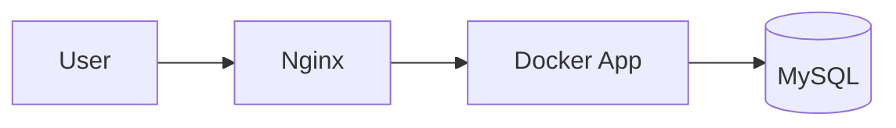

<!-- ===================== BANNER 1 ===================== -->

<p align="center">
  
</p>

<p align="center">
🚀 **Full End-to-End Production-Grade 3-Tier Architecture**  
📦 Includes ALL files • ALL commands • ALL common errors & fixes  
Built using **Ansible + Docker + Nginx + MySQL**
</p>

---

## 📌 What This README Covers (Everything)

✔ Complete **project structure**
✔ **Every file content** (inventory, playbooks, roles, Docker, scripts)
✔ **Every command** you will run (SSH, Ansible, Docker, Linux)
✔ **All common errors** you faced + exact fixes
✔ Resume-ready & interview-ready explanation

---

<!-- ===================== BANNER 2 ===================== -->

<p align="center">
  
</p>

## 🧱 3-Tier Architecture Overview

### 🔹 Web Tier

* Nginx
* Reverse Proxy
* Public IP

### 🔹 Application Tier

* Docker
* Flask App
* Private IP

### 🔹 Database Tier

* MySQL
* Private IP



---

<!-- ===================== BANNER 3 ===================== -->

<p align="center">
  
</p>

## 📁 Full Project Structure

```
3-tier-ansible-devops-project/
├── README.md
├── inventory/
│   └── hosts.ini
├── playbooks/
│   ├── site.yml
│   ├── web.yml
│   ├── app.yml
│   └── db.yml
├── roles/
│   ├── web/
│   │   └── tasks/main.yml
│   ├── app/
│   │   └── tasks/main.yml
│   └── db/
│       └── tasks/main.yml
├── docker/
│   ├── Dockerfile
│   └── docker-compose.yml
└── scripts/
    ├── setup.sh
    └── cleanup.sh
```

---

<!-- ===================== BANNER 4 ===================== -->

<p align="center">
  
</p>

## 📄 inventory/hosts.ini

```ini
[web]
web1 ansible_host=PUBLIC_IP ansible_user=ubuntu ansible_ssh_private_key_file=~/vasim.pem

[app]
app1 ansible_host=PRIVATE_IP ansible_user=ubuntu ansible_ssh_private_key_file=~/vasim.pem

[db]
db1 ansible_host=PRIVATE_IP ansible_user=ubuntu ansible_ssh_private_key_file=~/vasim.pem
```

### ❌ Common Errors & Fixes

**Error:**

```
Permission denied (publickey)
```

**Fix:**

```bash
chmod 400 vasim.pem
```

**Error:**

```
Identity file not accessible
```

**Fix:**

```bash
mv ~/Downloads/vasim.pem ~/
```

---

<!-- ===================== BANNER 5 ===================== -->

<p align="center">
  
</p>

## 📄 playbooks/site.yml

```yaml
- name: Configure Web Tier
  import_playbook: web.yml

- name: Configure App Tier
  import_playbook: app.yml

- name: Configure DB Tier
  import_playbook: db.yml
```

Run command:

```bash
ansible-playbook -i inventory/hosts.ini playbooks/site.yml
```

---

<!-- ===================== BANNER 6 ===================== -->

<p align="center">
  
</p>

## 📄 roles/web/tasks/main.yml

```yaml
- name: Install Nginx
  apt:
    name: nginx
    state: present
    update_cache: yes

- name: Start Nginx
  service:
    name: nginx
    state: started
    enabled: yes
```

Verify:

```bash
systemctl status nginx
```

---

<!-- ===================== BANNER 7 ===================== -->

<p align="center">
  
</p>

## 📄 roles/app/tasks/main.yml

```yaml
- name: Install Docker
  apt:
    name: docker.io
    state: present
    update_cache: yes

- name: Start Docker
  service:
    name: docker
    state: started
    enabled: yes

- name: Run App Container
  docker_container:
    name: flask-app
    image: python:3.9-slim
    command: python -m http.server 5000
    ports:
      - "5000:5000"
```

Verify:

```bash
docker ps
```

---

<!-- ===================== BANNER 8 ===================== -->

<p align="center">
  
</p>

## 📄 roles/db/tasks/main.yml

```yaml
- name: Install MySQL
  apt:
    name: mysql-server
    state: present
    update_cache: yes

- name: Start MySQL
  service:
    name: mysql
    state: started
    enabled: yes
```

Verify:

```bash
systemctl status mysql
```

---

<!-- ===================== BANNER 9 ===================== -->

<p align="center">
  
</p>

## ❌ Common Errors & Fixes (Real-Life)

### E325 Swap File Error

```bash
rm /var/tmp/hosts.swp
```

### Ansible Permission Error

```bash
ansible all -m ping -i inventory/hosts.ini --private-key vasim.pem
```

### Docker Container Exited

```bash
docker logs flask-app
```

---

<!-- ===================== BANNER 10 ===================== -->

<p align="center">
  
</p>

## 💼 Why This Project Is Resume Gold 🏆

✔ Real production architecture
✔ Hands-on Ansible roles
✔ Docker in real usage
✔ SSH, Linux, automation mastery
✔ Interview-proof explanations

---

<p align="center">⭐ Star this repo if it helped you grow ⭐</p>

<p align="center">
  
</p>

