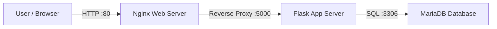
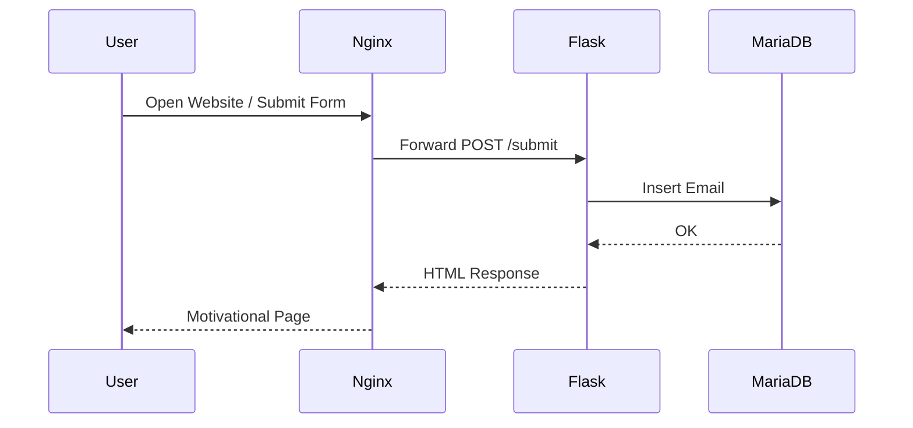
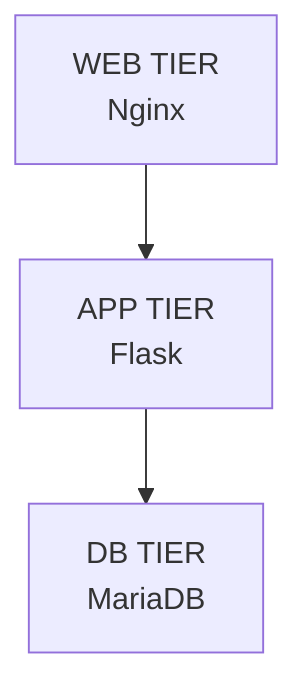

# 🚀 DEVOPS 3‑TIER ARCHITECTURE — FROM ZERO TO PRODUCTION

<p align="center">
  
  
  
</p>

<p align="center">
  <b>Web • App • Database</b><br/>
  <i>Not a copied tutorial. This is the food of hard work, debugging, and sleepless nights.</i>
</p>

---


This README is not documentation only — it is **proof of grind**.

---

## 🧠 WHAT THIS PROJECT PROVES

* I can build **real 3‑tier architecture** from scratch
* I can debug **502 errors, ports, services, permissions**
* I understand **how traffic flows in production systems**
* I don’t quit when things break

---

## 🏗️ FINAL ARCHITECTURE OVERVIEW



---

## 🔄 REQUEST FLOW (DETAILED)



---

## 🧱 3‑TIER BREAKDOWN



---

# 🛠️ COMPLETE STEP‑BY‑STEP BUILD (FROM SCRATCH)

---

## STEP 1️⃣ — SERVER SETUP (FOUNDATION)

* Created **3 Linux servers**

  * Web Server
  * App Server
  * Database Server
* Configured SSH access
* Verified connectivity between instances

> Lesson: Infrastructure comes before code.

---

## STEP 2️⃣ — SECURITY GROUP & NETWORKING

| Server | Port | Allowed From  |
| ------ | ---- | ------------- |
| Web    | 80   | Public        |
| App    | 5000 | Web Server SG |
| DB     | 3306 | App Server SG |

> Lesson: Most bugs are networking bugs.

---

## STEP 3️⃣ — WEB TIER (NGINX)

### Install Nginx

```bash
sudo dnf install nginx -y
sudo systemctl start nginx
sudo systemctl enable nginx
```

### Configure Reverse Proxy

```nginx
server {
  listen 80;
  location / {
    proxy_pass http://APP_PRIVATE_IP:5000;
    proxy_set_header Host $host;
    proxy_set_header X-Real-IP $remote_addr;
  }
}
```

> Lesson: Web server is the gatekeeper.

---

## STEP 4️⃣ — APP TIER (FLASK)

### Install Python & Flask

```bash
sudo dnf install python3 -y
pip3 install flask
```

### Build Flask Application

* `/` → Landing dashboard
* `/submit` → Form handling

> Lesson: Backend logic must be simple and clear.

---

## STEP 5️⃣ — DATABASE TIER (MARIADB)

### Install MariaDB

```bash
sudo dnf install mariadb105-server -y
sudo systemctl start mariadb
```

### Create Database & Table

```sql
CREATE DATABASE devopsdb;
USE devopsdb;
CREATE TABLE users (
  id INT AUTO_INCREMENT PRIMARY KEY,
  email VARCHAR(255) UNIQUE NOT NULL
);
```

> Lesson: Data layer must be protected and minimal.

---

## STEP 6️⃣ — END‑TO‑END DEBUGGING (REAL GRIND)

### Problems Faced:

* Port 5000 already in use
* Flask not restarting
* Permission denied errors
* 502 Bad Gateway
* Wrong IP / wrong proxy

### Fixes Applied:

* Used `ss -lntp` to find ports
* Killed zombie processes
* Restarted services cleanly
* Verified flow step by step

> **Logs were the real teachers.**

---

## STEP 7️⃣ — FINAL VERIFICATION

* Browser → Web → App → DB
* Email successfully stored
* Motivational page rendered

```sql
SELECT * FROM users;
```

---

## 🏆 FINAL RESULT

✔ Fully working 3‑Tier Architecture
✔ Production‑style flow
✔ Real debugging experience
✔ Portfolio‑ready project

---

## 👨‍💻 ABOUT THE BUILDER

**Name:** Arkan Tandel
**Role:** DevOps Engineer (in the making)

This project represents **discipline, frustration, patience, and growth**.

## 🔗 Links
- GitHub: https://github.com/arkantandel
- LinkedIn: https://www.linkedin.com/in/arkantandel


---
