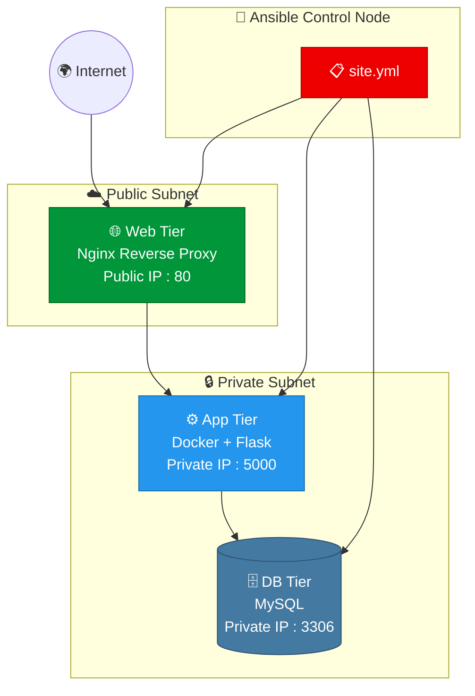

<div align="center">


<br/>

[](https://www.ansible.com/)
[](https://www.docker.com/)
[](https://nginx.org/)
[](https://www.mysql.com/)
[](https://flask.palletsprojects.com/)
[](https://www.linux.org/)

<br/>

> ### 🚀 Full End-to-End Production-Grade 3-Tier Architecture using Ansible + Docker + Nginx + MySQL

<br/>

```
╔══════════════════════════════════════════════════════════════════╗
║   📦 What's Inside?                                              ║
║   ✅ Complete Project Structure   ✅ Every File Content           ║
║   ✅ Every Command You'll Run     ✅ All Common Errors & Fixes    ║
║   ✅ Ansible Roles & Playbooks    ✅ Resume & Interview Ready     ║
╚══════════════════════════════════════════════════════════════════╝
```

</div>

---

<div align="center">

## 🗺️ Table of Contents

</div>

| # | Section |
|---|---------|
| 01 | [🧱 Architecture Overview](#-3-tier-architecture-overview) |
| 02 | [📁 Project Structure](#-full-project-structure) |
| 03 | [📄 Inventory File](#-inventoryhostsini) |
| 04 | [📄 Master Playbook](#-playbookssiteyml) |
| 05 | [🌐 Web Tier — Nginx Role](#-rolesweb) |
| 06 | [⚙️ App Tier — Docker Role](#️-rolesapp) |
| 07 | [🗄️ DB Tier — MySQL Role](#️-rolesdb) |
| 08 | [🐳 Docker Files](#-docker-files) |
| 09 | [📟 All Commands](#-all-commands-reference) |
| 10 | [❌ Common Errors & Fixes](#-common-errors--fixes-real-life) |
| 11 | [🎯 Interview Q&A](#-interview-qa) |
| 12 | [📄 Resume Tips](#-resume-tips) |

---

<div align="center">

## 🧱 3-Tier Architecture Overview

</div>

```
╔══════════════════════════════════════════════════════════════════╗
║              3-TIER ARCHITECTURE — PRODUCTION GRADE              ║
╠══════════════╦═══════════════════════╦═══════════════════════════╣
║  🌐 WEB TIER ║  ⚙️  APPLICATION TIER ║  🗄️  DATABASE TIER        ║
╠══════════════╬═══════════════════════╬═══════════════════════════╣
║  Nginx       ║  Docker               ║  MySQL                    ║
║  Reverse     ║  Flask App            ║  Port: 3306               ║
║  Proxy       ║  Port: 5000           ║  Private IP only          ║
║  Public IP   ║  Private IP           ║  No public access         ║
╚══════════════╩═══════════════════════╩═══════════════════════════╝
```

<br/>



---

<div align="center">

## 📁 Full Project Structure

</div>

```
3-tier-ansible-devops-project/
│
├── 📄 README.md
│
├── 📂 inventory/
│   └── 📄 hosts.ini                  ← EC2 IPs + SSH keys
│
├── 📂 playbooks/
│   ├── 📄 site.yml                   ← Master playbook (runs all)
│   ├── 📄 web.yml                    ← Nginx setup
│   ├── 📄 app.yml                    ← Docker + Flask setup
│   └── 📄 db.yml                     ← MySQL setup
│
├── 📂 roles/
│   ├── 📂 web/
│   │   └── 📂 tasks/
│   │       └── 📄 main.yml           ← Install & start Nginx
│   ├── 📂 app/
│   │   └── 📂 tasks/
│   │       └── 📄 main.yml           ← Install Docker, run container
│   └── 📂 db/
│       └── 📂 tasks/
│           └── 📄 main.yml           ← Install & configure MySQL
│
├── 📂 docker/
│   ├── 📄 Dockerfile                 ← Flask app image
│   └── 📄 docker-compose.yml         ← Multi-container setup
│
└── 📂 scripts/
    ├── 📄 setup.sh                   ← Bootstrap script
    └── 📄 cleanup.sh                 ← Teardown script
```

---

<div align="center">

## 📄 inventory/hosts.ini

</div>

> This file tells Ansible which servers to connect to and how.

```ini
# ============================
# 3-Tier Ansible Inventory
# ============================

[web]
web1 ansible_host=<WEB_PUBLIC_IP> ansible_user=ubuntu ansible_ssh_private_key_file=~/vasim.pem

[app]
app1 ansible_host=<APP_PRIVATE_IP> ansible_user=ubuntu ansible_ssh_private_key_file=~/vasim.pem

[db]
db1 ansible_host=<DB_PRIVATE_IP> ansible_user=ubuntu ansible_ssh_private_key_file=~/vasim.pem

[all:vars]
ansible_python_interpreter=/usr/bin/python3
```

**Test Connectivity:**
```bash
ansible all -m ping -i inventory/hosts.ini
```

**Expected Output:**
```
web1 | SUCCESS => { "ping": "pong" }
app1 | SUCCESS => { "ping": "pong" }
db1  | SUCCESS => { "ping": "pong" }
```

### ❌ Errors in Inventory

```
┌──────────────────────────────────────────────────────────────┐
│ Error: Permission denied (publickey)                         │
│ Fix:   chmod 400 ~/vasim.pem                                 │
├──────────────────────────────────────────────────────────────┤
│ Error: Identity file ~/vasim.pem not accessible              │
│ Fix:   mv ~/Downloads/vasim.pem ~/                           │
├──────────────────────────────────────────────────────────────┤
│ Error: ssh: connect to host ... port 22: Timed out           │
│ Fix:   Check EC2 Security Group → Port 22 open → Your IP     │
└──────────────────────────────────────────────────────────────┘
```

---

<div align="center">

## 📄 playbooks/site.yml

</div>

> The **master playbook** that imports and runs all 3 tier playbooks in order.

```yaml
---
# ================================
# Master Playbook — site.yml
# Runs: Web → App → DB in order
# ================================

- name: "🌐 Configure Web Tier (Nginx)"
  import_playbook: web.yml

- name: "⚙️ Configure Application Tier (Docker)"
  import_playbook: app.yml

- name: "🗄️ Configure Database Tier (MySQL)"
  import_playbook: db.yml
```

**▶️ Run Everything:**
```bash
ansible-playbook -i inventory/hosts.ini playbooks/site.yml
```

**▶️ Run with Verbose Output:**
```bash
ansible-playbook -i inventory/hosts.ini playbooks/site.yml -v
```

**▶️ Dry Run (Check Mode):**
```bash
ansible-playbook -i inventory/hosts.ini playbooks/site.yml --check
```

---

<div align="center">

## 🌐 roles/web/

</div>

### 📄 playbooks/web.yml

```yaml
---
- name: Web Tier Setup
  hosts: web
  become: yes
  roles:
    - web
```

### 📄 roles/web/tasks/main.yml

```yaml
---
# ================================
# Web Tier — Nginx Configuration
# ================================

- name: Update apt cache
  apt:
    update_cache: yes
    cache_valid_time: 3600

- name: Install Nginx
  apt:
    name: nginx
    state: present

- name: Start and enable Nginx
  service:
    name: nginx
    state: started
    enabled: yes

- name: Configure Nginx as Reverse Proxy
  copy:
    dest: /etc/nginx/sites-available/default
    content: |
      server {
          listen 80;
          location / {
              proxy_pass http://<APP_PRIVATE_IP>:5000;
              proxy_set_header Host $host;
              proxy_set_header X-Real-IP $remote_addr;
          }
      }
  notify: Restart Nginx

- name: handlers
  meta: flush_handlers
```

**✅ Verify:**
```bash
systemctl status nginx
curl http://localhost
```

---

<div align="center">

## ⚙️ roles/app/

</div>

### 📄 playbooks/app.yml

```yaml
---
- name: App Tier Setup
  hosts: app
  become: yes
  roles:
    - app
```

### 📄 roles/app/tasks/main.yml

```yaml
---
# ================================
# App Tier — Docker + Flask Setup
# ================================

- name: Update apt cache
  apt:
    update_cache: yes

- name: Install Docker
  apt:
    name: docker.io
    state: present

- name: Start and enable Docker
  service:
    name: docker
    state: started
    enabled: yes

- name: Install Docker Python SDK
  pip:
    name: docker
    state: present

- name: Pull Python image
  docker_image:
    name: python:3.9-slim
    source: pull

- name: Run Flask App Container
  docker_container:
    name: flask-app
    image: python:3.9-slim
    command: python -m http.server 5000
    ports:
      - "5000:5000"
    state: started
    restart_policy: always
```

**✅ Verify:**
```bash
docker ps
docker logs flask-app
curl http://localhost:5000
```

---

<div align="center">

## 🗄️ roles/db/

</div>

### 📄 playbooks/db.yml

```yaml
---
- name: DB Tier Setup
  hosts: db
  become: yes
  roles:
    - db
```

### 📄 roles/db/tasks/main.yml

```yaml
---
# ================================
# DB Tier — MySQL Configuration
# ================================

- name: Update apt cache
  apt:
    update_cache: yes

- name: Install MySQL Server
  apt:
    name: mysql-server
    state: present

- name: Install Python MySQL dependency
  apt:
    name: python3-mysqldb
    state: present

- name: Start and enable MySQL
  service:
    name: mysql
    state: started
    enabled: yes

- name: Create application database
  mysql_db:
    name: appdb
    state: present

- name: Create DB user
  mysql_user:
    name: appuser
    password: "SecurePass123!"
    priv: "appdb.*:ALL"
    host: "%"
    state: present
```

**✅ Verify:**
```bash
systemctl status mysql
mysql -u root -e "SHOW DATABASES;"
```

---

<div align="center">

## 🐳 Docker Files

</div>

### 📄 docker/Dockerfile

```dockerfile
# ================================
# Flask App Dockerfile
# ================================
FROM python:3.9-slim

WORKDIR /app

COPY requirements.txt .
RUN pip install --no-cache-dir -r requirements.txt

COPY app.py .

EXPOSE 5000

CMD ["python", "app.py"]
```

### 📄 docker/docker-compose.yml

```yaml
version: '3.8'

services:
  flask-app:
    build: .
    container_name: flask-app
    ports:
      - "5000:5000"
    environment:
      - DB_HOST=db
      - DB_USER=appuser
      - DB_PASS=SecurePass123!
      - DB_NAME=appdb
    depends_on:
      - db
    restart: always

  db:
    image: mysql:8.0
    container_name: mysql-db
    environment:
      MYSQL_ROOT_PASSWORD: rootpass
      MYSQL_DATABASE: appdb
      MYSQL_USER: appuser
      MYSQL_PASSWORD: SecurePass123!
    ports:
      - "3306:3306"
    volumes:
      - db_data:/var/lib/mysql
    restart: always

volumes:
  db_data:
```

---

<div align="center">

## 📟 All Commands Reference

</div>

**🔧 Setup:**
```bash
# Install Ansible on Control Node
sudo apt update && sudo apt install -y ansible

# Verify installation
ansible --version

# Set correct permissions on key
chmod 400 ~/vasim.pem

# Test all hosts
ansible all -m ping -i inventory/hosts.ini
```

**▶️ Run Playbooks:**
```bash
# Run everything
ansible-playbook -i inventory/hosts.ini playbooks/site.yml

# Run specific tier only
ansible-playbook -i inventory/hosts.ini playbooks/web.yml
ansible-playbook -i inventory/hosts.ini playbooks/app.yml
ansible-playbook -i inventory/hosts.ini playbooks/db.yml

# Dry run (no changes)
ansible-playbook -i inventory/hosts.ini playbooks/site.yml --check

# Verbose mode
ansible-playbook -i inventory/hosts.ini playbooks/site.yml -vvv
```

**🐳 Docker Commands:**
```bash
# Check running containers
docker ps

# View container logs
docker logs flask-app

# Stop container
docker stop flask-app

# Remove container
docker rm flask-app

# Run docker-compose
docker-compose up -d

# Stop docker-compose
docker-compose down
```

**🗄️ MySQL Commands:**
```bash
# Connect to MySQL
mysql -u root -p

# Show databases
SHOW DATABASES;

# Use app DB
USE appdb;

# Show tables
SHOW TABLES;
```

---

<div align="center">

## ❌ Common Errors & Fixes (Real-Life)

</div>

<br/>

### 🔴 E325: Vim Swap File Error
```
E325: ATTENTION - Found a swap file
```
```bash
# Fix: Remove the swap file
rm /var/tmp/hosts.swp
# Or remove all swap files
find /var/tmp -name "*.swp" -delete
```

---

### 🔴 Ansible SSH Permission Denied
```
fatal: [web1]: UNREACHABLE! => {"msg": "Permission denied (publickey)"}
```
```bash
# Fix 1: Correct key permissions
chmod 400 ~/vasim.pem

# Fix 2: Test SSH manually
ssh -i ~/vasim.pem ubuntu@<EC2_PUBLIC_IP>

# Fix 3: Specify key in command
ansible all -m ping -i inventory/hosts.ini --private-key ~/vasim.pem
```

---

### 🔴 Docker Container Keeps Exiting
```
CONTAINER ID   STATUS
abc123         Exited (1) 5 seconds ago
```
```bash
# Fix: Check container logs for error
docker logs flask-app

# Fix: Run interactively to debug
docker run -it python:3.9-slim bash

# Fix: Add restart policy in Ansible task
restart_policy: always
```

---

### 🔴 Ansible "Gathering Facts" Hangs
```
TASK [Gathering Facts] ******* (stuck here)
```
```bash
# Fix: Check if Python3 exists on target
ssh -i vasim.pem ubuntu@<IP> "python3 --version"

# Fix: Install Python3 on target
sudo apt install -y python3

# Fix: Set interpreter in inventory
ansible_python_interpreter=/usr/bin/python3
```

---

### 🔴 MySQL Authentication Error
```
ERROR 1698 (28000): Access denied for user 'root'@'localhost'
```
```bash
# Fix: Use sudo for MySQL
sudo mysql -u root

# Fix inside MySQL:
ALTER USER 'root'@'localhost' IDENTIFIED WITH mysql_native_password BY 'password';
FLUSH PRIVILEGES;
```

---

### 🔴 Port Already in Use
```
Error: Bind for 0.0.0.0:5000 failed: port is already allocated
```
```bash
# Fix: Find and kill the process using port 5000
sudo lsof -i :5000
sudo kill -9 <PID>

# Or remove old container
docker rm -f flask-app
```

---

<div align="center">

## 🎯 Interview Q&A

</div>

<br/>

**Q1: What is 3-Tier Architecture?**
```
3-Tier separates an application into 3 logical layers:
  Layer 1 → Presentation (Web/Nginx) — User-facing
  Layer 2 → Application (Docker/Flask) — Business logic
  Layer 3 → Data (MySQL) — Data persistence

Benefits: Scalability, Security, Maintainability
```

**Q2: Why use Ansible for this?**
```
Ansible provides Infrastructure as Code (IaC):
  → Idempotent: Run playbooks multiple times safely
  → Agentless: No software needed on target servers
  → YAML-based: Human-readable configuration
  → Roles: Reusable, modular automation
```

**Q3: What is an Ansible Role?**
```
A Role is a standardized way to organize playbook content.
Structure:
  roles/
    web/
      tasks/      ← What to do
      handlers/   ← Triggered actions (e.g., restart)
      templates/  ← Jinja2 config templates
      vars/       ← Role variables
      defaults/   ← Default variable values
```

**Q4: What is the difference between import_playbook and include_playbook?**
```
import_playbook  → Static: parsed at startup, always runs
include_playbook → Dynamic: parsed at runtime, can be conditional
```

**Q5: How does Nginx act as a Reverse Proxy here?**
```
User → Nginx (Port 80, Public IP)
Nginx → Forwards to Flask App (Port 5000, Private IP)

Benefits:
  → Hides backend servers from internet
  → SSL termination at Nginx
  → Load balancing across multiple app servers
```

**Q6: Why use Docker for the App Tier?**
```
  → Portability: Runs the same on any server
  → Isolation: App runs in its own container
  → Easy rollback: Switch image versions instantly
  → Scalability: Scale containers without new VMs
```

---

<div align="center">

## 📄 Resume Tips

</div>

<br/>

```
💼 Resume Bullet Point (copy & customize):

"Designed and deployed a production-grade 3-Tier Architecture
 using Ansible for configuration management, Docker for
 containerized Flask application deployment, Nginx as a reverse
 proxy, and MySQL as the database layer — automating the full
 infrastructure setup across 3 EC2 instances using Ansible roles
 and playbooks."
```

**🔑 Keywords for Resume/LinkedIn:**
```
Ansible • Ansible Roles • Playbooks • Infrastructure as Code (IaC)
Docker • Containerization • Nginx • Reverse Proxy • MySQL
3-Tier Architecture • DevOps • Linux • EC2 • SSH • YAML
Configuration Management • Agentless Automation • Flask • Python
```

---

<div align="center">

## 📊 Quick Reference Cheatsheet

```
┌───────────────────────────────────────────────────────────────┐
│              3-TIER ANSIBLE PROJECT — CHEATSHEET              │
├──────────────────────┬────────────────────────────────────────┤
│  Control Node        │  Ansible installed here               │
│  Web Tier Port       │  80 (Nginx)                           │
│  App Tier Port       │  5000 (Flask/Docker)                  │
│  DB Tier Port        │  3306 (MySQL)                         │
│  SSH Key Perm        │  chmod 400 vasim.pem                  │
│  Run All             │  ansible-playbook site.yml -i hosts   │
│  Ping Test           │  ansible all -m ping -i hosts.ini     │
│  Docker Check        │  docker ps / docker logs              │
│  MySQL Check         │  systemctl status mysql               │
│  Nginx Check         │  systemctl status nginx               │
└──────────────────────┴────────────────────────────────────────┘
```

---

## 🌟 Star This Repo If It Helped You!

[](https://github.com/arkantandel)

---

### 🔗 Connect With Me

[](https://github.com/arkantandel)
[](https://www.linkedin.com/in/arkantandel)
[](https://github.com/arkantandel)

</div>

---


<div align="center">
<sub>Made with ❤️ by <a href="https://github.com/arkantandel">Arkan Tandel</a> · 3-Tier Architecture with Ansible — Complete DevOps Guide</sub>
</div>
